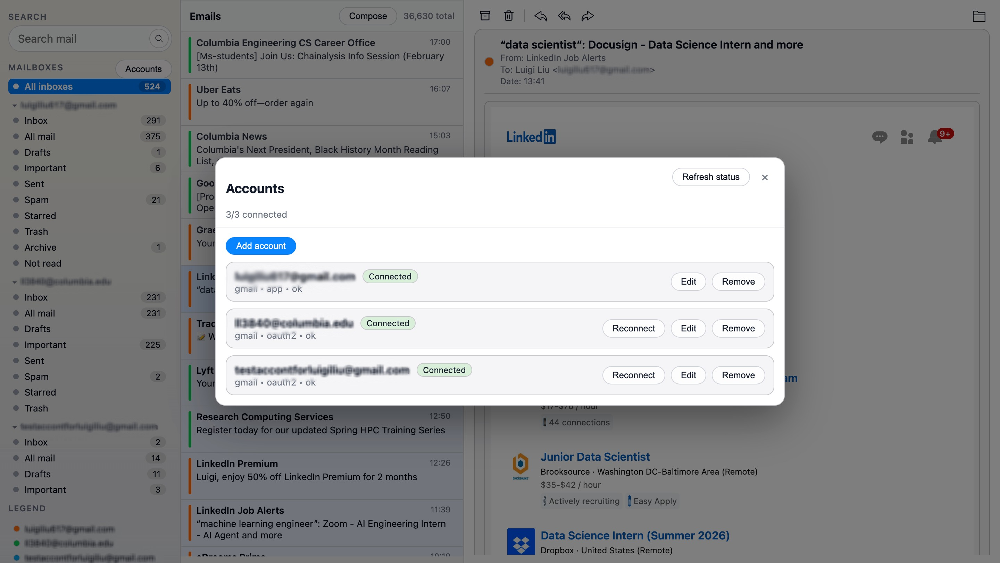

# OpenMail

OpenMail is an **open-source, self-hostable email management product** powered by a robust **Python library**.

It provides:
- a **local-first web application** for managing email
- a **Python toolkit** for IMAP, SMTP, search, and AI-assisted workflows

You can run OpenMail entirely on your own machine or server — no hosted SaaS required.

---

## ✨ Features

The OpenMail **web application** provides:

- 📥 Inbox, folders, and threaded email navigation
- 🔍 Advanced search and filtering (rule-based + AI-assisted)
- 🧵 Conversation and thread views
- 🧠 AI-powered features (in progress):
  - email summarization
  - reply and follow-up generation
  - task extraction
  - prioritization and classification
  - phishing detection
  - sender trust evaluation
- 🏷️ Flags, triage, and cleanup workflows
- 📎 Attachment inspection and summaries
- 🔕 Newsletter detection and unsubscribe helpers
- 🗂️ Folder operations (move, copy, archive)
- 🔐 Local-first, self-hosted execution
- ⚙️ Configurable LLM providers (OpenAI, Claude, Gemini, Groq, XAI, etc.)

All email credentials and data remain under your control.

---

## 🌐 Email Website




---

## 🚀 Getting Started (Run Locally)

These steps explain how to run OpenMail **locally from source**, including the web app.

---

### 1. Clone the repository

```
git clone https://github.com/luigi617/openmail.git
cd openmail
```

---

### 2. Create and activate a virtual environment

```
python -m venv .venv
source .venv/bin/activate
```

---

### 3. Install the Python package

```
pip install -e ".[web]"
```

This installs the OpenMail Python library in development mode.

---

### 4. Configure your email account (`.env`)

OpenMail reads email configuration from environment variables.  
You can see the expected variables in the **email_service** module.

Create a `.env` file in the project root:

```
touch .env
```

Example `.env`:

```
# Email account configuration

# If not set, default to 8000
PORT=...

# To generate: python -c "from cryptography.fernet import Fernet; print(Fernet.generate_key().decode())"
EMAIL_SECRET_KEY=...

# Optional: LLM providers
OPENAI_API_KEY=sk-...
ANTHROPIC_API_KEY=...
GOOGLE_API_KEY=...
XAI_API_KEY=...
GROQ_API_KEY=...
```

Notes:
- You only need to configure the LLM providers you plan to use

---

### 5. Run the web application

OpenMail includes a helper script to run the web UI locally.

```
bash run_web.sh
```

Once started, open your browser at:

```
http://localhost:<port>
```

You now have a fully local OpenMail instance running.

---

## 🐍 Python Library Package

OpenMail can also be used **purely as a Python library**, without the web UI.

The library provides:

- `EmailManager` — IMAP/SMTP orchestration
- `EmailQuery` — fluent, lazy IMAP query builder
- `EmailAssistant` — optional LLM-powered email intelligence

Example import:

```
from openmail import EmailManager, EmailQuery, EmailAssistant
```

The **same core library** powers the web application.

See [here](/docs/Package.md) directory for detailed API documentation.

---

## 🤝 Contributing

Contributions are welcome.

You can help by:
- fixing bugs
- adding features
- improving the web UI
- extending email provider support
- improving documentation
- adding tests

Basic workflow:

```
1. Fork the repository
2. Create a feature branch
3. Make your changes
4. Add tests if applicable
5. Submit a pull request
```

Please keep pull requests focused and well-described.

---

## 🐞 Reporting Issues

If you encounter a bug or have a feature request:
open an issue [here](https://github.com/luigi617/openmail/issues).


---

## 🪪 License

MIT
